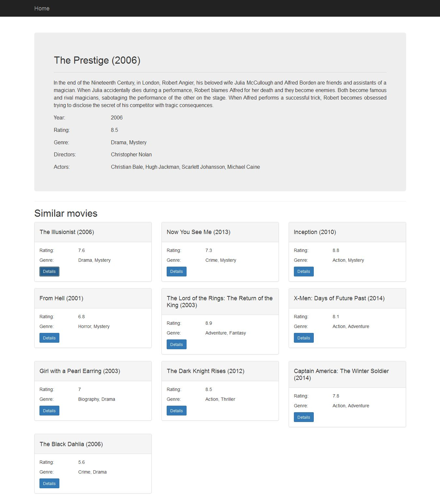

Content based movie recommendation
==============

#1. About the project
The objective of this project is to develop a Web application for movie search and recommendation. Movie data needs to be downloaded from available sources on the Web, stored in a local database, and then recommendation algorithm is applied and computed data is also stored in a local repository.
Main application development phases:
* downloading data from available API-s or directly from Web pages
* storing data in a local database
* applying recommendation algorithm to available movie data
* finding top 10 similar movies for each movie, and storing data in a database
* implementation of a user interface for movie search and recommendation

#2. Dataset
After analyzing the data obtained from the selected data sources ([YTS]( https://yts.to/api/ ) and [IMDB]( http://www.imdb.com/ )), and having in mind the data needed for performing recommendation, the downloaded data is structured and stored in the following manner:

Movie
* movie id - long
* movie description - String (text)
* imdb rating - double
* movie genres - String []
* movie title - String
* release year - int
* actors - Object [] - where each object has following fields: imdb code (person id from IMDB site) and name
* directors - Object [] - where each object has following fields: imdb code (person id from IMDB site) and name
* imdb code - String - this is actually movie id for particular movie on IMDB site, a very convinient field that YTS api provides and it is used for integration of movie data from these two sources
* movie reviews - String []
* similar movies - long [] - after applying the algorithm for computing similarities between movies, stores ids of 10 most similar movies

Application is using data from two different sources ([YTS]( https://yts.to/api/ ) and [IMDB]( http://www.imdb.com/ )), and after downloading it, the data is integrated and stored in a MongoDB database. 

[YTS]( https://yts.to/api/ ) API provides all needed data except movie reviews. 
Because of that, movie IMDB code is downloaded so it can be used for searching for reviews directly on IMDB site. The service returns data in JSON format. Since the maximum number of movies that can be retrieved in one call is 50, the API needs to be called in iterations. Example of an API call:
```
https://yts.to/api/v2/list_movies.json?limit=50&page=10
```
For every movie (of 50 downloaded) another API should be called to obtain the movie details we need for our purposes. 
Example of an API call to the Movie details API:
```
https://yts.to/api/v2/movie_details.json?movie_id=10
```
When it comes to directors and actors data, besides their names, person IMDB code is downloaded for every person so it could be uniquely identified. This is important because actor and director data is used for computing recommendations.

[IMDB]( http://www.imdb.com/ ) site is used for downloading movie reviews to be used for computing recommendations. Since there is no corresponding API available, data is downloaded directly from the IMDB pages. Data is scraped using [Enlive] (https://github.com/cgrand/enlive) library. IMDB Code is used for integration of existing data and downloaded reviews.

#3. Recommendation algorithm
For recommendation purposes, content-based recommendation is chosen where movie attributes are used for computing similarities. [Vector Space Model] (https://en.wikipedia.org/wiki/Vector_space_model) approach is used for calculating similarities among movies. In particular, Vector Space Model represents text document as vectors of identifiers, in this specific case, these vectors are vectors of terms. Each dimension in a vector corresponds to a separate term. For every term in a document vector, there is a value assigned. These values (term weights) can be computed in several ways and approach that is chosen here is [TF-IDF] (https://en.wikipedia.org/wiki/Tf%E2%80%93idf) method. 

In the first iteration, just movie description is used for computing TF-IDF. 

Movie descriptions need to be preprocessed before computing TF-IDF:
* transform whole text to lowercase
* tokenize description
* remove stop-words from the list of tokens - stop words are the words that occur the most often but they do not carry any semantic information; so, they are removed
* stemming is applied to every token - in order to reduce tokens to their root, base form and avoid that word derivations (for example plural) are treated as different words. For this purpose, Porter stemming algorithm is used.
After these steps, TF-IDF is calculated for every term of a movie description. Three variations of TF-IDF algorithm have been used and tested in this project. IDF is always computed using the same formula:
```
IDF (t) = log(N/n), where N is the number of movies and n is the number of movies where term t occurs.
```
IDF value for the term is the same for every movie description so it is calculated once and used for every movie.
When it comes to TF calculation, there are several variations, three of them are tested here.
```
- Classic, standard formula - TF (t,d) = f(t,d)/n, where f(t,d) means frequency of a term t in a document d and n is a number of terms in a document d. ([1](http://www.tfidf.com/))
- Logarithmic - TF (t,d) = 1 + log f(t,d), where logarithm of term frequency in a document is calculated ([2](http://nlp.stanford.edu/IR-book/pdf/irbookonlinereading.pdf))
- Augmented - TF (t,d) = a + (1-a) * f(t,d)/max{f(t,d) : t e d}, where term frequency is scaled by the maximum frequency of any word in document d and where a is a value between 0 and 1 and is generally set to 0.4, although some early work used the value 0.5.([2](http://nlp.stanford.edu/IR-book/pdf/irbookonlinereading.pdf))
```

After some testing, Logarithmic and Augmented variations showed better results.

In the next iteration, movie title, actors, directors and genres were included in the recommendation algorithm. Also, some scaling needed to be done here, because just including title tokens, actors and other attributes with frequency 1 would not be appropriate (the relevance of these attributes would be diminished). So, weight factors are used for these attributes and multiplied by the number of terms in a document (movie description). This allows movie attributes to contribute equally in every movie. 
```
So lets say that after preprocessing is done, there are 50 terms extracted from a movie description 
(not different terms but summed frequencies of terms). If we decide that we want to use the weight of 
0.05 for actors, each actor will be added to the list of tokens for a movie with the assigned term 
frequency of 2.5 (50 * 0.05). 

```
Different weights were tested for each of the aforementioned movie attributes, and through several iterations of testing, weights that give solid recommendations were identified. For actors and directors, IMDB code is used as a term instead of a person name to avoid that different person with the same name is treated as a same person.

It was observed that the recommendation algorithm tend to recommend movies that have the same name for a main character, even though they are not really similar to the selected movie. That is why another iteration was needed to try to remove personal names from the analysis. Personal names were removed in the preprocessing phase that preceded the computation of  TF-IDF values. As predicted, this iteration really improved recommendation results.

For many movies, length of collected descriptions was insufficient for recommendation algorithm to give good results. Therefore, an additional source of movie descriptions was needed. It was found in IMDB reviews of movies which proved to be very informative when it comes to particular movie and its content. Hence, reviews were used for extending the movie vectors. Reviews were downloaded directly from IMDB site, stored in the database and later used in the recommendation algorithm. Reviews are very specific when it comes to certain words and phrases used, so some kind of stop-word list specific for reviews was used to filter those phrases (for example, word spoiler/spoilers).

At this point, traditional TF-IDF approach with computing sparse matrix (with 99% of values being zero) was not applicable because the matrix could not fit into memory. Custom approach is then used where data is stored into maps with term - tf-idf value as key/value pairs.

In the last iteration, cut off percentage is introduced. This parameter specifies percentage of most and least frequently occurring terms in a corpus that should be removed from corpus and further analysis. This is a configurable parameter whose value can be specified in a configuration file before the application is started. Value "0" is also valid and in that case, no terms will be removed.

After calculating TF-IDF weights, there is still one more step needed in order to compute recommendations. That step is actually calculating similarities between movies. For that purpose, Cosine similarity is used. Cosine similarity takes two vectors (of same size) and calculates similarity score. As a result from applying TF-IDF algorithm there is a vector of TF-IDF term weights for every movie and these vectors are used to calculate similarity between each pair of movies. Then, top 10 similar movies for each movie (with highest cosine similarity score) are retrieved and stored in a MongoDB database.
Cosine similarity computing algorithm is listed below.
```
Cosine Similarity (d1, d2) =  Dot product(d1, d2) / ||d1|| * ||d2||

Dot product (d1,d2) = d1[0] * d2[0] + d1[1] * d2[1] * … * d1[n] * d2[n]
||d1|| = square root(d1[0]2 + d1[1]2 + ... + d1[n]2)
||d2|| = square root(d2[0]2 + d2[1]2 + ... + d2[n]2)
```

#4. Implementation
Application is written in Clojure programming language. 

When implementing the Web application, the following technologies were used:

1. [Hiccup](https://github.com/weavejester/hiccup) - Hiccup is a library for representing HTML in Clojure. Vectors are used for representing elements and maps for their attributes. It is used for developing the user interface. [Bootstrap] (https://github.com/weavejester/hiccup) is used for application design and styling. 

2. [Enlive](https://github.com/cgrand/enlive) - Enlive is a selector-based templating library for Clojure. It is used for downloading movie reviews from IMDB pages.

3. [Cheshire] (https://github.com/dakrone/cheshire) - Cheshire is used for parsing JSON data received from API.

4. [Ring] (https://github.com/ring-clojure/ring) is a Clojure library for developing web applications. 
Ring abstracts details of HTTP into a simple, unified API, allowing web applications to be constructed of modular components that can be shared among a variety of applications, web servers, and web frameworks. Ring uses standard Clojure 
maps to represent the client requests and the responses returned by the server.

5. [Compojure] (https://github.com/weavejester/compojure) - Compojure is a routing library built on top of Ring. It provides an easy way for defining web application routes.

6. [Monger] (http://clojuremongodb.info/) - a library for accessing MongoDB database. 
MongoDB is a document oriented database that provides high performance and flexible schema. It maps nicely to Clojure data structures.

7. [Leiningen] (http://leiningen.org/) - used as a build tool.

8. Other libraries used for different tasks like HTTP requests, tokenizing text and so on.

#5. Use Case
Application provides user interface for movie search and displaying movie details as well as recommendations.
One possible use case is specified bellow:

1. User comes to the application start page.

2. User enters title (or just part of the title) in the search field.
Pagination is implemented so movies don't need to be loaded in memory at once.

3. Search results are shown to the user and he can choose to see movie details for desired movie. Besides movie details, top 10 recommended movies for particular movie are shown on movie details page.


#6. Running the application

1. Install Leiningen - instructions can be found at http://leiningen.org/
2. Install MongoDB - instructions can be found at http://docs.mongodb.org/manual/installation/
3. In cmd, navigate to the directory you want to store this project in and run: git clone https://github.com/stefanvuckovic/clojureproject.git
4. You need to set up application configuration which is stored in conf/config.json
The configuration file looks like this:
```
{
  "info" : { "import" : 1, "download/calculate" : 2, "use-existing-data" : 3 },
  "movies" : 3,
  "similarities" : 2,
  "database-field-for-similarity" : "similar",
  "tfidf-variation" : "classic",
  "cutoff" : 0.02
}
```

* "Info" element states the options available for "movies" and "similarities" elements. If option 1 is chosen for "movies" and/or "similarities" elements, when the application starts, movies (or similarities or both) will be imported from a file populated with movie data already downloaded and/or computed. Using option 2 for "movies" element means that movies will be downloaded from API when the application starts. This should be used with caution since it is a long running process. 
Using option 2 with the "similarities" element means that recommendation algorithm will be applied when the application starts; this is a very memory and time consuming process. Option 3 with both movies and similarities means that you want to use your local database that is already populated before. You will probably want to set option 1 for both elements on the first application launch. Data will then be imported from files to your database. After that, you should set option 3 for both elements so on every further launch data from your local database will be used.
* Element "database-field-for-similarity" should be used to define name of the field for storing similar movies. This option is available so you can run application several times with different algorithms for calculating recommendations and you can change name of this field every time so you can later compare recommended movies from different algorithms. Otherwise you would always have similar movies in one field and would not be able to do any comparisons.
*Element "tfidf-variation" is used for specifying the variation of a TF-IDF algorithm you want to use for computing recommendations. Available options for this element are "classic", "aug" and "log". In the testing done within this project, Augmented ("aug") and Logarithmic ("log") variations of the algorithm gave better results than the Classic ("classic") option.
*Element "cutoff" is used for specifying percentage of the most and least used words that will be removed from the corpus. 
5. After configuring these parameters, you can navigate to the project root directory in cmd and run "lein ring server" command. Application will start.

#7. Conclusions and further work
When it comes to further work, I think it would be interesting to apply some kind of dimension reduction algorithm on results from TF-IDF algorithm and compare results with current approach. As a next step I see applying Latent Semantic Analysis (LSA) and/or Random Indexing algorithm in order to reduce matrix dimensions, calculate similarities faster which is a big problem right now and see how these algorithms influence results.

#8. Licence
Distributed under the Eclipse Public License, the same as Clojure.
