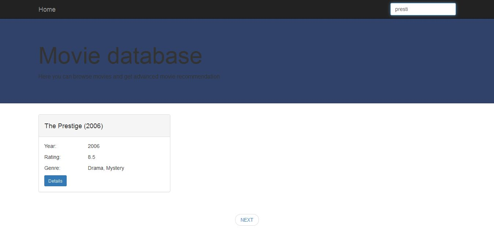

movierecommenderapp
==============

#1. About project
Topic of this project is developing of a web application for searching and recommendation of movies. Movie data needs to be downloaded from available sources on the web, then recommendation algorithm is applied and then downloaded and computed data is stored in a local database.
Main application development phases:
* downloading data from available API-s or directly from web pages
* storing data in a local database
* applying recommendation algorithm to available movie data
* finding top 10 similar movies for every movie and storing data in a database
* implementation of a user interface for movie searching and displaying recommendations

#2. Domain model
After analyzing the data provided by the selected data sources ([YTS]( https://yts.to/api/ ) [IMDB]( http://www.imdb.com/ )) and needed data for performing recommendation proposed structure of the data that is downloaded and stored is:

Movie
* movie id
* movie description
* imdb rating
* movie genres
* movie title
* release year
* actors
* directors
* imdb code
* movie reviews 
* similar movies - after applying algorithm for computation similarities between movies, store 10 most similar

#3. Solution
Application is using data from two different sources ([YTS]( https://yts.to/api/ ) [IMDB]( http://www.imdb.com/ )), data is then integrated and stored
in a MongoDB database. 

[YTS]( https://yts.to/api/ ) API provides all needed data except movie reviews data. 
Because of that, imdb code of movies is downloaded so it can be used for searching for reviews directly on IMDB site. Data is in JSON format where maximum number of movies that can be downloaded at once is 50 so API needs to be called in iterations. 
For every movie (of 50 downloaded) another API should be called with movie details we need for our purposes. When it comes to directors and actors data, besides name, imdb_code is downloaded for every person so it could be uniquely identified. That is important because actor and director data is used for computing recommendations.

[IMDB]( http://www.imdb.com/ ) site is used for downloading movie reviews to be used for computing recommendations. Since there is no corresponding API available, data is downloaded directly from the IMDB pages. IMDB Code is used for integration of existing data and downloaded reviews.

Also, application provides the user interface for movie search and displaying movie details as well as recommendations.

1. User comes to the application start page.

2. User enters title (or just part of the title) in search field.
Pagination is implemented so movies don't need to be loaded in memory at once.

3. Search results are showed to user and he can choose to see movie details for desired movie. Besides movie details, 
top 10 recommended movies for particular movie are showed on movie details page.


#4. Recommendation algorithm
For recommendation purposes, movie attributes were used, so content based recommendation is implemented. Vector Space Model approach is used for calculating similarities between movies. Vector Space Model represents text document as vectors of identifiers,
in this specific case, these vectors are vectors of terms. Each dimension in a vector corresponds to a separate term. For every term
in a document vector, there is a value assigned. These values (term weights) can be computed in several ways and approach that is chosen
here is TF-IDF method. 

In first iteration, just movie description is used for computing. 

There is preprocessing that needs to be done on description before computing TF-IDF:
* transform whole text to lowercase
* tokenize description
* remove stop-words from the list of tokens - stop words are the words that occurs the most often but they do not carry any semantic information so they are removed
* stemming is applied for every token - in order to reduce tokens to their root, base form and avoid that word derivations (for example plural) 
are treated as different words. For this purpose, Porter stemming algorithm is used.

After these steps, TF-IDF can be calculated for every term inside movie description. There are three variations of TF-IDF algorithm
used and tested in this project. IDF is always computed with same formula:
 IDF (t) = log(N/n), where N is the number of movies and n is the number of movies where term t occurs.
IDF value for the term is the same for every movie description so it is calculated once and used for every movie.
When it comes to TF calculation, there are several variations, three of them are tested here.
- Classic, standard formula - TF (t,d) = f(t,d)/n, where f(t,d) means frequency of a term t in a document d and n is a number of terms in a document d.
- Logarithmic - TF (t,d) = 1 + log f(t,d), where logarithm of term frequency in a document is calculated
- Augmented - TF (t,d) = 0.4 + 0.6 * f(t,d)/max{f(t,d) : t e d}, where term frequency is scaled by the maximum frequency of any word in document d

Ater some testing, Logarithmic and Augmented variations showed better results.

In next iteration, it was decided to include movie title, actors, directors and genres in recommendation algorithm. Also, some scaling needed to be
done here, because just including title tokens, actors and other attributes with frequency 1 didn't make any sense. So, weight factors are used for these
attributes and applied on number of terms in a document (movie description). This allows movie attributes to contribute equally in every movie. 
```
So lets say that after preprocessing is done, there are 50 terms extracted from movie description (not different terms but summed frequencies of terms). If we decide that we want to use factor of 0.05 for actors, each actor will be added to the list
of tokens for a movie with frequency = 50 * 0.05. 
```

Different factors were used for every movie attribute and with trial and error method, I came to factors that made sense and gave 
solid recommendations. For actors and directors, imdb_code is used as a term and not their names to avoid that different person with 
same name is treated as same person.

What I did not like is that I often received recommendations for movies that had the same name for a main character, but they are not 
really similar. That is why another iteration was needed to try to remove personal names from analysis. As predicted, this iteration 
really improved recommendation results.

There were still problems with recommendation system. For many movies, length of collected descriptions were often insufficient, so recommendation
algorithm could not get good results. I needed more data about movies. Looking at the IMDB reviews, I came to the conclusion that these reviews
were very informative when it comes to particular movie and it's content. I decided to include reviews in TF-IDF algorithm. Reviews were downloaded
directly from IMDB site, stored in database and later used in recommendation algorithm.

At this point, traditional TF-IDF approach with computing sparse matrix (with 99% of values being zero) were not good because matrix could not fit into
memory. Custom approach is then used where data is stored into maps with term - tf-idf value as key/value pairs. That means that there were adjustments 
that needed to be made before computing cosine similarities.

After calculating TF-IDF weights, there is still one more step needed in order to compute recommendations. That step is actually calculating 
similarities between movies. For that purpose, Cosine similarity is used.


#5. Implementation
Application is written in Clojure programming language. 

When implementing web application, following technologies are used:

1. [Hiccup](https://github.com/weavejester/hiccup) - Hiccup is a library for representing HTML in Clojure. Vectors are used for
representing elements and maps for their attributes. It is used for developing of a user interface. [Bootstrap] (https://github.com/weavejester/hiccup) is used for application design
and styling. 

2. [Enlive](https://github.com/cgrand/enlive) - Enlive is a selector-based templating library for Clojure. It is used for downloading movie reviews from 
IMDB pages.

3. [Cheshire] (https://github.com/dakrone/cheshire) - Cheshire is used for parsing JSON data received from API.

4. [Ring] (https://github.com/ring-clojure/ring) is a Clojure library for developing web applications. 
Ring abstracts details of HTTP into a simple, unified API, allowing web applications to be constructed of modular components that can be shared among a variety of applications, web servers, and web frameworks. Ring uses standard Clojure 
maps to represent the client requests and the responses returned by the server.

5. [Compojure] (https://github.com/weavejester/compojure) - Compojure is a routing library built on top of Ring. It is built on top of Ring and provides an easy way for defining web application routes.

6. [Monger] (http://clojuremongodb.info/) - a library for accessing MongoDB database. 
MongoDB is a document oriented database that provides high performance and flexible schema. It maps nicely to Clojure data structures.

7. [Leiningen] (http://leiningen.org/) - used as a build tool.

8. Other libraries used for different tasks like HTTP requests, tokenizing text and so on.

#6. Usage

1. Install Leiningen - instructions can be found at http://leiningen.org/
2. Install MongoDB - instructions can be found at http://docs.mongodb.org/manual/installation/
3. In cmd, navigate to the directory you want to store this project in and run: git clone https://github.com/stefanvuckovic/clojureproject.git
4. You need to set up application configuration which is stored in conf/config.json
```
Configuration files looks like this:

{
  "info" : { "import" : 1, "download/calculate" : 2, "use-existing-data" : 3 },
  "movies" : 3,
  "similarities" : 2,
  "database-field-for-similarity" : "similar-max",
  "tfidf-variation" : "aug"
}

Info element states what options are available for movies and similarities element. 
If you choose option 1, when application starts movies (or similarities or both) will be imported from file which is populated with data already downloaded and/or computed for you. Using option 2 for movies element means that movies 
will be downloaded from API when you start application. This is maybe something you don't want to do, because it is a long running process. 
Using option 2 with similarities element mean that recommendation algorithm will be applied when you start application and this is a very memory and time consuming process. 
Option 3 with both movies and similarities means that you want to use your local database that is already populated before. 
You will probably want to set option 1 for both elements on first launch of an application. Data will then be imported
from files to your database. After that, you should set option 3 for both elements so on every further launch data from 
your local database will be used.
Element "database-field-for-similarity" should be used to define name of the field for storing similar movies. This option is
available so you can run application several times with different algorithms for calculating recommendations and you can change
name of this field every time so you can later compare recommended movies from different algorithms. Otherwise you would always have
similar movies in one field and can't do any comparations.
Element "tfidf-variation" is used for specifying the variation of a TF-IDF algorithm you want to use for computing recommendations.
Available options for this elements are "classic", "aug" and "log". Augmented ("aug") and Logarithmic ("log") variations of algorithm 
give better results than Classic ("classic") in my opinion.
5. After configuring these parameters, you can navigate to the project root directory in cmd and run "lein ring server" command.
Application will start.


```

#7. Conclusions and further work
Results I was getting with recommendation algorithm were satisfying. 
When it comes to further work, I think it would be interesting to apply dimension reduction on results from TF-IDF algorithm and compare 
results with current approach. As a next step I see applying Latent Semantic Analysis (LSA) and/or Random Indexing algorithm in order
to reduce dimensions of a matrix, calculate similarities faster which is a big problem right now and see how these algorithms influence results.

#8. Licence
Distributed under the Eclipse Public License, the same as Clojure.
